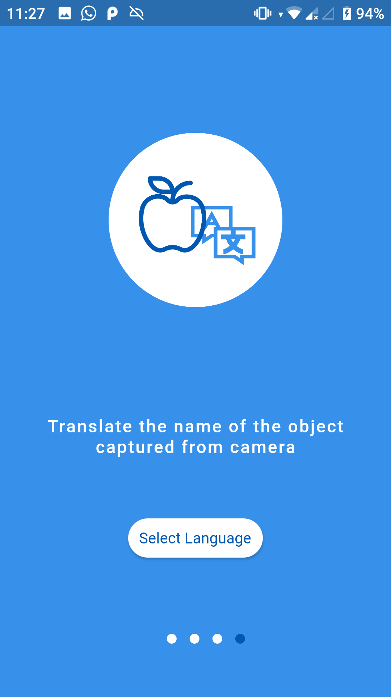
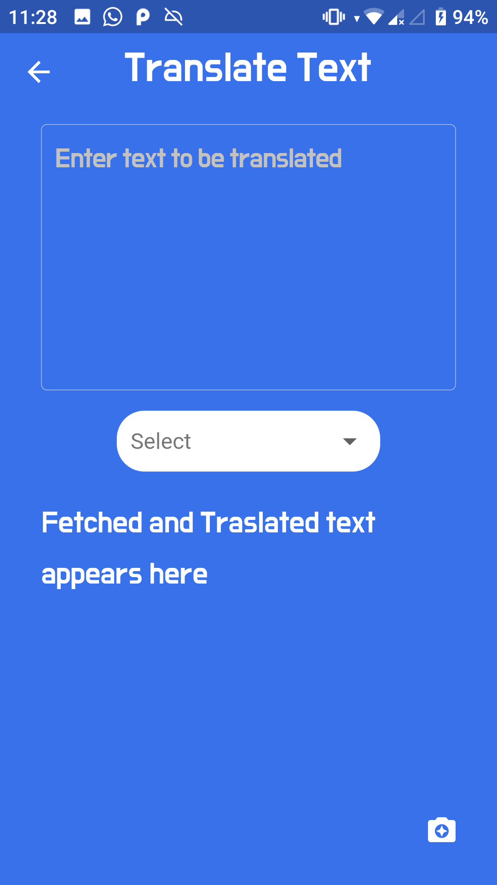
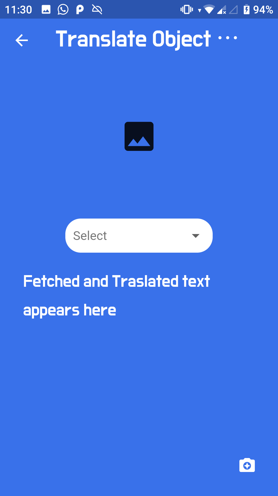

# Transify

An application to translate text either type or fetch text from image and translate in desired language. Find the translation of the object name captured using camera in desired language and find the language spoken in a region by capturing nearby landmark.

## App Screenshots : 

  
  
  
  
  
  
  
  
  
  

